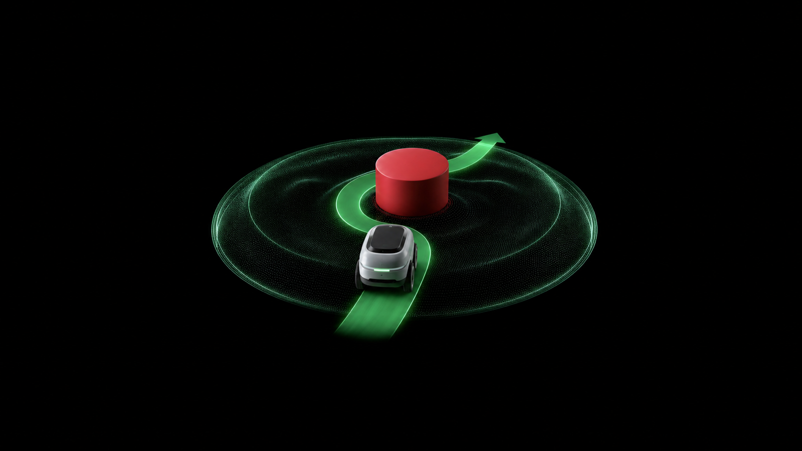
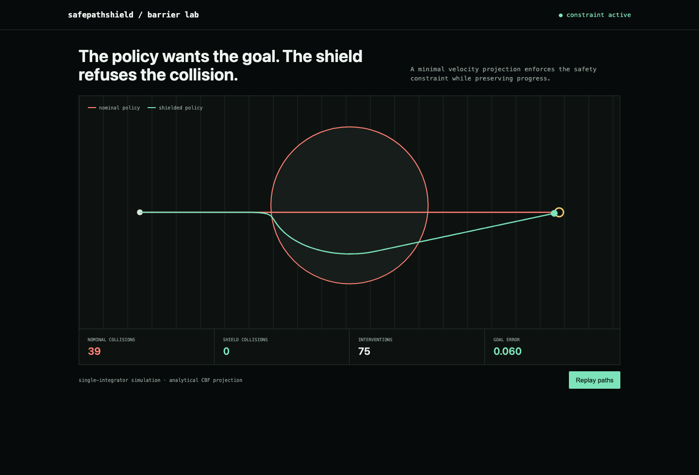

# safepathshield

**A control-barrier safety layer for learned robot policies.**

Wrap a nominal motion policy with a minimally invasive quadratic safety projection, compare both trajectories, and export a checkable path artifact.





## What ships

- Nominal goal controller and analytical control-barrier projection
- Side-by-side unsafe and shielded simulations with collision, clearance, intervention, and goal metrics
- Deterministic SVG trajectory export
- CLI, JSON API, animated browser demo, Docker, tests

## Run it end to end

```bash
python -m venv .venv && source .venv/bin/activate
python -m pip install -e .
safepathshield demo
safepathshield render trajectory.svg
safepathshield serve
```

## Demo result

The nominal controller drives through the obstacle. The barrier projection changes only unsafe velocity commands, preserves non-negative clearance, and still reaches the goal. Tests verify the barrier inequality directly, not just the rendered path.

## Current basis

- [Learning control barrier functions and their application in reinforcement learning](https://proceedings.mlr.press/v270/hu25a.html)

## Update: the safety guarantee only held at the published dt

`safety_filter` enforces the CONTINUOUS-time control-barrier condition
`grad(h)·v + alpha*h >= 0` at the current position, then the simulator
applies the resulting velocity for one finite-size discrete step. That
linearization ignores the `|v*dt|^2` curvature term a real Euler step
introduces, so for a large-enough control-loop period the "safe" velocity
can still land the robot's next position inside the obstacle.

Verified directly: at `dt=0.3` (a 3.3 Hz control loop -- slower than the
default 25 Hz, but not an unreasonable rate for a real system with
planning or actuation lag), the published shield produces an actual
collision (`minimum_clearance = -0.015`). A 60-scenario randomized sweep
over dt, start position, and obstacle/robot radii (40 tuning seeds + 20
disjoint holdout seeds) found the original filter collides in roughly
half of realistic configurations on both sweeps (21/40 tuning, 11/20
holdout), with a worst-case penetration of nearly 0.29 units.

Fixed in a new, non-destructive `core_v2.py` (the original `core.py` is
untouched -- the published demo numbers below still reproduce exactly)
using a discrete-time-exact barrier projection: it enforces
`h(x + v'*dt) >= (1 - min(alpha*dt, 1)) * h(x)` against the true next
position, solved as the quadratic it actually is, instead of a linear
approximation of it. Re-running the same 60-scenario sweep against
`core_v2.analyze_v2` produces **zero** collisions on both tuning and
holdout sets. `tests/test_adversarial.py` covers the dt=0.3 collision
reproduction, the v2 fix on that same scenario, the full tuning/holdout
sweep, and a demo-output regression check.

## Scope

The shipped benchmark is a deterministic single-integrator robot with one circular obstacle. Deployment on physical systems additionally requires full dynamics, uncertainty-aware state estimation, actuator limits, and hardware validation.

## Test

```bash
python -m unittest discover -s tests -v
```

MIT licensed.
